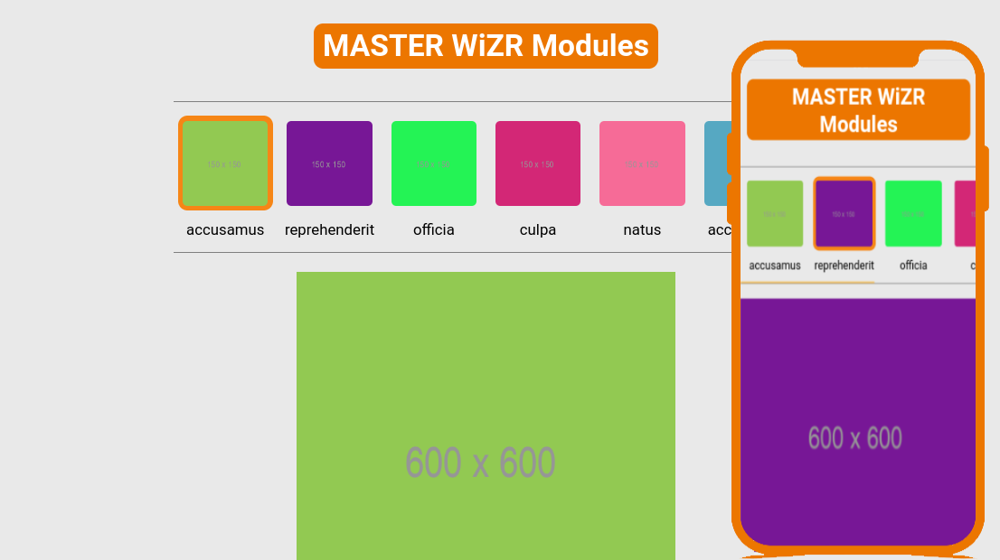

# WiSR Assignment

> This is an image slider that gets images from api and show only the first six.

# Screenshot

## Built With

- ReactJS, Scss

## Live Demo

[Netlify](https://mwzr-task.netlify.app/)

## Getting Started

To get a local copy up and running follow these simple example steps.

- Run `npm i` 
- Run `npm start` 

## Authors

👤 **Mohamed Amine**

- GitHub: [@AmineHLub](https://github.com/AmineHLub)
- Twitter: [@Amino47612441](https://twitter.com/Amino47612441)
- LinkedIn: [LinkedIn](https://www.linkedin.com/in/mohamed-amine-hajltaief-b18863163/)

## 🤝 Contributing

Contributions, issues, and feature requests are welcome!

Feel free to check the [issues page](../../issues/).

## Show your support

Give a ⭐️ if you like this project!

## Acknowledgments

- Hat tip to anyone whose code was used
- Inspiration
- etc

## 📝 License

This project is [MIT](./MIT.md) licensed.
